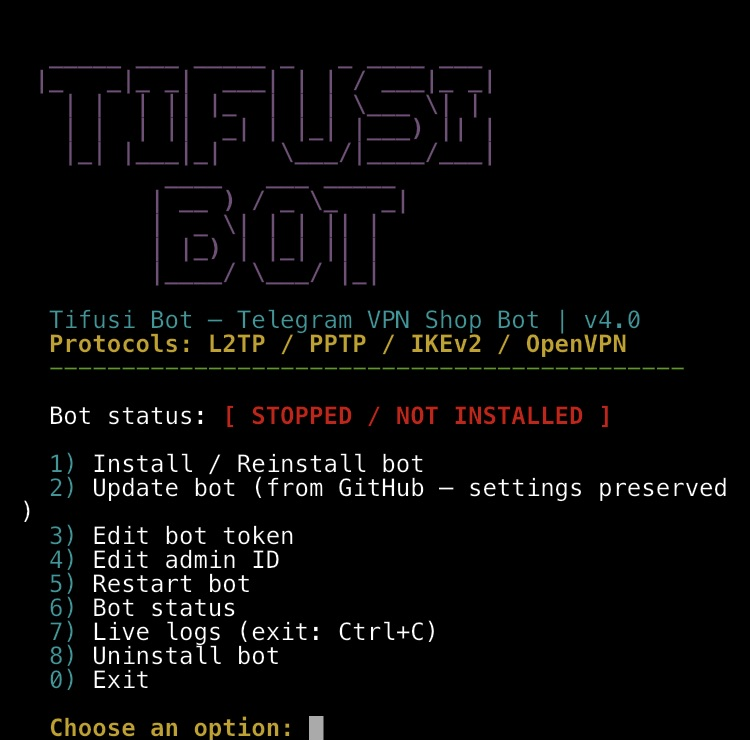

<p align="center">
  
</p>

<h1 align="center">TIFUSI BOT</h1>

<div align="center">

**Telegram bot for selling VPN subscriptions — version 4.1**

[](https://www.python.org/)
[](https://github.com/python-telegram-bot/python-telegram-bot)
[](https://t.me/javadheydeari)
[](#)
[](LICENSE)

 <b>English</b> &nbsp;·&nbsp;  <a href="README.fa.md">فارسی</a>

⭐ If this project is useful to you, give it a **Star**!

</div>

---

## 📋 Overview

**Tifusi Bot** is a complete Telegram storefront for selling VPN subscriptions. It works only with **[Tifusi Panel](https://github.com/javadtifusi-eng/Tifusi-Panel)**.

The customer taps "Buy subscription", picks a service (protocol), then a plan, and sends the username they want. The bot does the rest: payment, creating the user on the least busy panel, delivering the **access code**, **subscription link** and **QR code**, expiry reminders, renewals and refunds, all automatically. ⚡

> 🔑 **No passwords.** Customers never type a password. The panel issues each user a subscription link and an access code (like `javad7KQ4MP9X@panel-address`). In the **[Tifusi VPN](https://github.com/javadtifusi-eng/Tifusi-VPN)** app (Android / Windows) the code is entered on the "Servers" tab, or the QR is scanned with "Scan QR"; on iPhone the subscription link opens in Safari. Renewing keeps the code, link and QR unchanged.

### 📡 Protocols come straight from the panel

The bot knows every service, but **only offers a service to customers when the panel has a host for it**:

| Service in the bot | Panel protocols |
|---|---|
| 🌐 Xray | VLESS / VMess / Trojan / Shadowsocks |
| ⚡ Hysteria2 | Hysteria2 |
| 🛡 IKEv2 | IKEv2 |
| 🔗 L2TP | L2TP |
| 🔒 WireGuard | WireGuard (once added to the panel) |

- If the panel only has IKEv2, the bot only sells IKEv2.
- Added a new protocol on the panel? In the bot tap "🖥 Panel management → panel → 🔄 Check connection" (it is also checked automatically every 5 minutes) and it goes on sale. Remove a host and its service is taken off sale automatically and the admin is notified.
- A customer who buys IKEv2, for example, gets access to IKEv2 **only**, not to every protocol.

**Adding a panel:** Panel management → ➕ Add panel → name, panel address (for example `https://panel.example.com`), and the panel admin's username and password. The bot tests the connection and reads the panel's protocols and groups; you then pick a **group** for each available service, or "Don't sell on this panel", and finally the location and user cap.

**Service → group mapping:** a panel group decides which servers a user can reach; a server that is in no group is available to everyone. The mapping can be changed at any time from the panel details → "🧩 Choose service groups".

> ♻️ **Upgrading from older versions:** on first start, non-Tifusi panels from very old versions (vpn-ui and others) are removed from the bot and their orders are archived (they stay in the statistics). Users, wallets, plans and Tifusi Panel orders are untouched. Take a copy from "💾 Backup" before upgrading.

---

## ✨ Features

| Area | Description |
|---|---|
| 🛍️ **Plan store** | Unlimited plans with data, duration, price and simultaneous device limit |
| 📡 **Protocols from the panel** | Only protocols that have hosts on the panel are sold; panel changes apply automatically |
| 📱 **Full delivery** | Access code, subscription link, QR code and Tifusi VPN download links for Android and Windows |
| 🔑 **Test account** | Once per user; off by default and enabled from General settings |
| 🖥️ **Multiple panels** | Several servers with custom capacity; when one panel is full, new purchases move to the next |
| 🔄 **Smart renewal** | Always renews the same user on the same panel; code, link and QR stay the same |
| 📊 **Wallet and receipts** | Top up by sending a receipt, approved or rejected by the admin; atomic balance deduction (double tap = one purchase) |
| ⏰ **Expiry reminders** | Automatic messages 3 days and 1 day before expiry and on expiry, with a renew button |
| 📢 **Broadcast** | Text or photo to all users at a Telegram-safe rate, with a result report |
| 💾 **Backup** | Instant backup, automatic daily backup (to the admin and an optional channel) and restore from inside the bot |
| 🛡️ **Admin panel** | Sales statistics and management of orders, plans, panels, users and admins |

---

## 🚀 One-line install (recommended)

On an Ubuntu server (20.04 or later), run as root:

```bash
bash <(curl -Ls https://raw.githubusercontent.com/javadtifusi-eng/Tifusi-Bot/main/install.sh)
```

> ⚠️ This link is public; anyone can install without logging in.

The installer starts with a colored interface and does the following automatically:

```
  _____ ___ _____ _   _ ____ ___
 |_   _|_ _|  ___| | | / ___|_ _|
   | |  | || |_  | | | \___ \| |
   | |  | ||  _| | |_| |___) || |
   |_| |___|_|    \___/|____/___|
          ____   ___ _____
         | __ ) / _ \_   _|
         |  _ \| | | || |
         | |_) | |_| || |
         |____/ \___/ |_|

  🤖 Tifusi Bot — VPN subscription store | version 4.0
```

1. ✅ Installs prerequisites (Python, pip and the required libraries)
2. ✅ Downloads the bot file and checks it
3. ✅ Asks for your **bot token** and **admin ID**
4. ✅ Creates a systemd service (starts automatically after reboot)
5. ✅ Creates the `tifusi bot` command to bring the menu back at any time

### 📖 Installer management menu

After installing, type `tifusi bot` in the terminal to bring this menu back (`tifusi panel` opens the Tifusi Panel menu and `tifusi app` shows the latest Tifusi VPN release):

```
1) Install / Reinstall bot
2) Update bot (from GitHub — settings preserved)
3) Edit bot token
4) Edit admin ID
5) Restart bot
6) Bot status
7) Live logs (exit: Ctrl+C)
8) Uninstall bot
0) Exit
```

---

## 🔧 Manual install

```bash
# 1) Prerequisites
apt update && apt install -y python3 python3-pip
pip3 install python-telegram-bot[job-queue] requests qrcode pillow --break-system-packages

# 2) Download the bot
curl -Ls https://raw.githubusercontent.com/javadtifusi-eng/Tifusi-Bot/main/bot.py -o /root/bot.py

# 3) Set the token and admin (lines at the top of the file)
nano /root/bot.py
# BOT_TOKEN = "token from @BotFather"
# ADMIN_ID = numeric ID from @userinfobot

# 4) Run
python3 /root/bot.py
```

---

## ⚙️ Tifusi Panel requirements

The bot needs **[Tifusi Panel](https://github.com/javadtifusi-eng/Tifusi-Panel)** to create accounts. Check the following on each panel:

- [ ] The panel is installed and its address (preferably HTTPS with a valid certificate) is reachable from the bot server
- [ ] Create **a separate admin** for the bot in the panel (Settings → Admins) with **Users** and **Groups** permissions; do not use the panel owner's account
- [ ] Cores and **hosts** for the services you sell are defined on the panel (every protocol with a host is sold by the bot)
- [ ] (Optional) You created a **group** in the panel for each service to decide which servers its users connect to; without groups every server is public

---

## 📐 Plan rules

| Rule | Description |
|---|---|
| Data | The first number in the plan title = data in GB · the word «نامحدود» (unlimited) = no cap |
| Price | Don't put the price **first in the title** (it would be read as the data amount) |
| Devices | 1 to 5 simultaneous devices · 0 = no device limit |
| Panel capacity | Only active, unexpired services are counted · renewals are never blocked by a full panel |

---

## 💾 Backup and restore

- **Admin panel → 💾 Backup → 📥 Get backup now:** a `.db` file with users, wallet balances, orders, receipts, panels, plans and settings.
- **Automatic backup:** every night at 3:00 to the main admin (can be turned off). If you set a "Backup channel ID" in "⚙️ General settings", it is sent there too; the bot must be an admin in that channel.
- **Restore:** main admin only: 💾 Backup → ♻️ Restore → send the file → confirm. The previous database is kept next to it with a `.before-restore` suffix.

---

## 🖼️ Screenshot

<div align="center">

**One-line installer with a graphical menu:**



</div>

---

## ❓ FAQ

**Users' VPN dropped for a moment after a purchase. Why?**
When any user is created or changed, Tifusi Panel syncs the node configuration again and connections may drop and reconnect briefly. The bot makes only that one change on the panel for each purchase.

**I added a new protocol on the panel but it doesn't show in the bot.**
In the bot: 🖥 Panel management → panel → 🔄 Check connection. If you had previously chosen "Don't sell on this panel" for that protocol, enable it again from "🧩 Choose service groups".

**How many users can the bot serve at once?**
Messages from different users are processed concurrently and the panel login is not repeated for each purchase, so one slow purchase doesn't make others wait. The real bottleneck is the panel's speed and node syncing, not the bot.

**My bot token leaked?**
Send `/revoke` to @BotFather and enter the new token from the `tifusi bot` menu (option 3).

---

## 📬 Contact

[](https://t.me/javadheydeari)

---

## 🤝 Support

- 🐞 Found a bug? Report it in **Issues**
- ⭐ Useful? Don't forget to **Star** it!

---

## 📜 License

Tifusi Bot is **source-available, not open source**. You may read the code, install the unmodified bot and use it to sell your own service. Copying any part of the code, modifying and republishing it, rebranding it or selling the bot itself requires written permission. See [LICENSE](LICENSE).

<div align="center">

Made with ❤️ for VPN sellers

</div>
